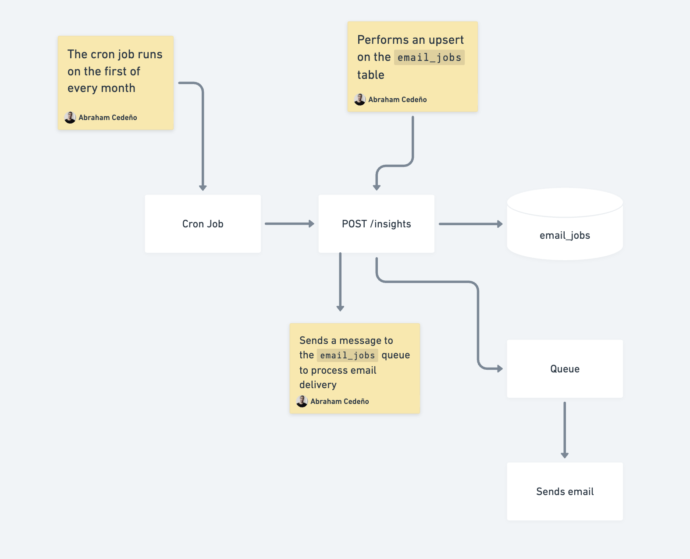
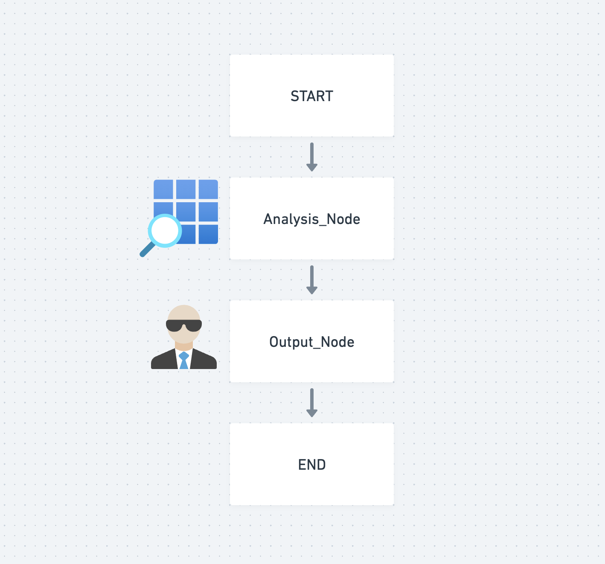

## Food Tracker

<table border="0" cellspacing="0" cellpadding="0" style="border-collapse: collapse; border: none;">
  <tr>
    <td></td>
    <td></td>
    <td></td>
    <td></td>
    <td></td>
    <td></td>
  </tr>
</table>

This is a FastAPI backend that combines LangChain Agents, Supabase, and pgvector to deliver an AI-powered food tracking system. The API supports natural-language queries, vector search, and tool calling agents to retrieve meals, symptoms, and user-specific data.

It uses an Agentic RAG pipeline to ground responses on user-uploaded documents stored in Supabase.

Features:

- FastAPI backend with clean modular architecture
- LangChain agent with custom tools
- Supabase pgvecytor for document embeddings and semantic search
- Agentic RAG ( tool invocation + retrieval )
- Authentication and per-user data isolation
- Pydantic schemas
- Chat endpoint with streaming to improve the perceived responsivenes by creating a faster, more fluid, and human-like interaction.
- Guardrails for monitoring agent work
- LangGraph workflows for monthly recommendations

This is the list of existing endpoints:

<table>
  <thead>
    <tr>
      <th>Verb</th><th>Resource</th><th>Description</th><th>Scope</th>
    </tr>
  </thead>
  <tbody>
    <tr>
      <td>POST</td><td>/login</td><td>Supabase sign in</td><td>Public</td>
    </tr>
    <tr>
      <td>GET</td><td>/foods</td><td>Get food list</td><td>Protected</td>
    </tr>
    <tr>
      <td>GET</td><td>/foods/:id</td><td>Get a single food</td><td>Protected</td>
    </tr>
    <tr>
      <td>POST</td><td>/foods</td><td>Create a food</td><td>Protected</td>
    </tr>
    <tr>
      <td>PUT</td><td>/foods/:id</td><td>Update food</td><td>Protected</td>
    </tr>
    <tr>
      <td>DELETE</td><td>/foods/:id</td><td>Delete food</td><td>Protected</td>
    </tr>
    <tr>
      <td>GET</td><td>/meals</td><td>Get meal list</td><td>Protected</td>
    </tr>
    <tr>
      <td>GET</td><td>/meals/:id</td><td>Get a single meal</td><td>Protected</td>
    </tr>
    <tr>
      <td>POST</td><td>/meals</td><td>Create a meal</td><td>Protected</td>
    </tr>
    <tr>
      <td>PUT</td><td>/meals/:id</td><td>Update meal</td><td>Protected</td>
    </tr>
    <tr>
      <td>DELETE</td><td>/meals/:id</td><td>Delete a meal</td><td>Protected</td>
    </tr>
    <tr>
      <td>GET</td><td>/symptoms</td><td>Get symptom list</td><td>Protected</td>
    </tr>
    <tr>
      <td>GET</td><td>/symptoms/:id</td><td>Get a single symptom</td><td>Protected</td>
    </tr>
    <tr>
      <td>POST</td><td>/symptoms</td><td>Create a symptom</td><td>Protected</td>
    </tr>
    <tr>
      <td>PUT</td><td>/symptoms/:id</td><td>Update a symptom</td><td>Protected</td>
    </tr>
    <tr>
      <td>DELETE</td><td>/symptoms/:id</td><td>Delete a symptom</td><td>Protected</td>
    </tr>
    <tr>
      <td>POST</td><td>/documents</td><td>Uploads a document</td><td>Protected</td>
    </tr>
    <tr>
      <td>POST</td><td>/chat</td><td>Sends a message to the agent</td><td>Protected</td>
    </tr>
    <tr>
      <td>POST</td><td>/insights</td><td>Gathers monthly insights per user</td><td>Hidden</td>
    </tr>
  </tbody>
</table>

### Workflow

The GET /insights endpoint is a special endpoint that runs every month. It is triggered by a cron job and its sole purpose is to prepare recommendations for users based on the meals and symptoms caused by them in the last month.

You can see the process summarized in the image below:



#### The Process Flow

1. Scheduled Trigger

A cron job runs on the first of every month (automated scheduling)

2. Insights Generation

The cron job makes a POST /insights request to the API endpoint,
which triggers the AnalystAgent and OutputAgent workflow.

3. Dual Database Operations

Upserts to email_jobs table: Stores the email job record with user info, content, and status
Queue message: Sends a message to the email_jobs queue for processing

4. Asynchronous Processing

Jobs are queued for background processing (using PostgreSQL's pgmq - PostgreSQL Message Queue)

5. Email Delivery

A background worker processes the queue and sends the actual emails

Key Architecture Benefits:
- Reliability: Database record ensures no emails are lost
- Idempotency: Upsert prevents duplicate emails for the same user/period
- Scalability: Async queue handles email delivery without blocking the API
- Monitoring: Database records allow tracking of email status (PENDING/SENT/FAILED)

The diagram of the workflow is as follows:



As you can see it's simply a graph with two nodes:

#### Analysis Node(AnalystAgent)

The analysis node is responsible for:

**Data Analysis**: Acts as an expert histamine allergy data analyst that processes user data to identify patterns and correlations between foods consumed and symptoms experienced.

**Tool Usage**: Has access to specialized tools (via create_tools(db)) that can query the database to gather necessary food and symptom data for a specific user.

**Insight Generation**: Analyzes which foods a user should avoid and which ones they should consume more of based on their symptom patterns.

**Data Processing**: Takes a user ID as input and performs deep analysis by invoking: "Which foods the user {user_id} should avoid and which ones they should eat more of based on their symptoms."

**Raw Analysis Output**: Returns detailed analytical findings that serve as input for the next stage.

#### Output Node(OutputAgent)

The output node is responsible for:

**Content Formatting**: Takes the raw analysis from the analyst and transforms it into user-friendly, digestible insights.

**User Experience**: Ensures the recommendations are clear, actionable, and empathetic to users dealing with histamine allergies.

**Content Constraints**: Applies specific formatting rules:

Maximum 8 bullet points
Each bullet point limited to 20 words
Uses simple, accessible language
Maintains a neutral, clear tone
No Additional Analysis: Focuses solely on presentation and communication rather than performing new analysis.

**Final Output**: Produces the final insights that will be delivered to the user.


### Deployment

You can deploy it to railway by conteinerizing the application, pushing it to dockerhub and then pulling it from there.

```shell
docker buildx build --platform linux/amd64,linux/arm64 -t username/food-tracker:v1.0 --push .
```

### How to run it locally ?

Clone the repository

```shell
git clone food-tracker-api
```

Create a virtual environment

```shell
python3 -m venv food-tracker-env
```

Activate it

```shell
source food-tracker-env/bin/activate
```

Install your exact dependencies

```shell
pip install -r requirements.txt
```

Run it

```shell
fastapi dev main.py
```

### How to run unit tests ?

You can run the unit tests by issuing the following command:

```shell
pytest
```

### Contributing

Pull requests are welcome. For major changes, please open an issue first to discuss what you would like to change.

### License

This project is licensed under the MIT License - see the [LICENSE](LICENSE) file for details.
