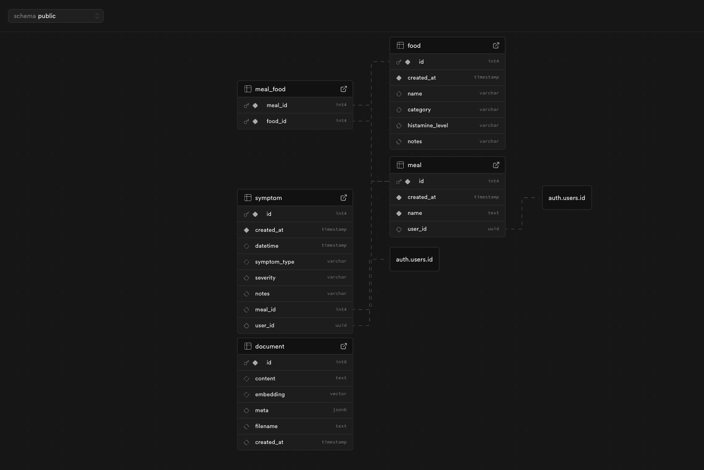

### Summary

In this section resides all the data modeling you need to set everything up in Supabase.
In the image below you can preview the database schema.

  

### Cardinality

User 1 --- N Meal (one-to-many)

Meal 1 --- N Food (one-to-many)

User 1 --- N Symptom (one-to-many)

Meal 1 --- N Meal_Food (one-to-many)

### Stored Procedures

In the rpc folder you will find the following remote procedure calls:

- create_meal_with_foods
- update_meal_with_foods
- create_symptom_for_user
- update_symptom_for_user
- match_embeddings

### Row Level Security

In the rls.sql file you will find the row level security policies pertaining to each table.

Finally, in the schema.sql file the sql instructions in order to create each table and their corresponding relationships.